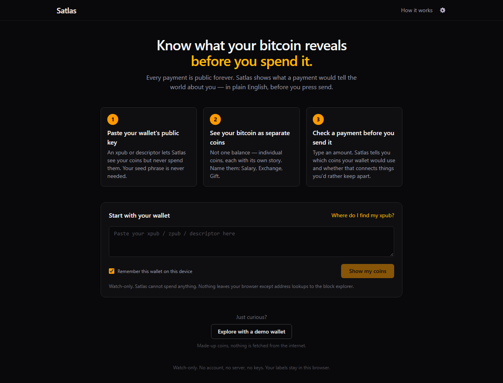
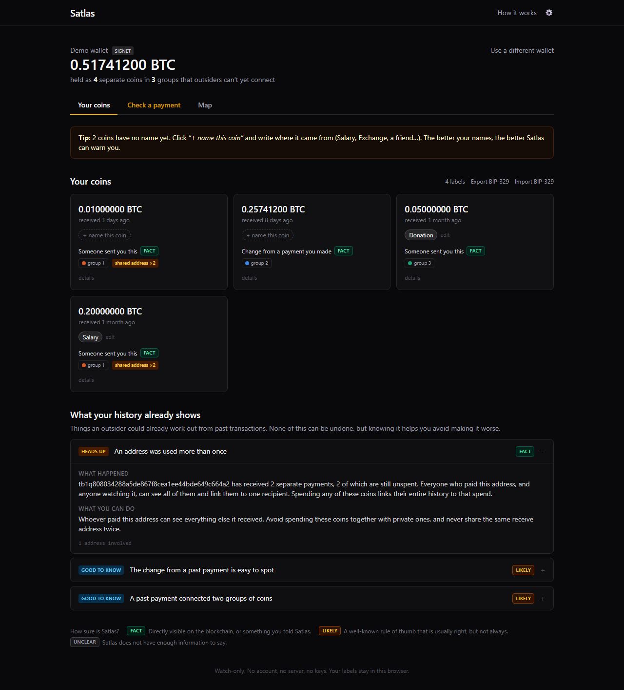
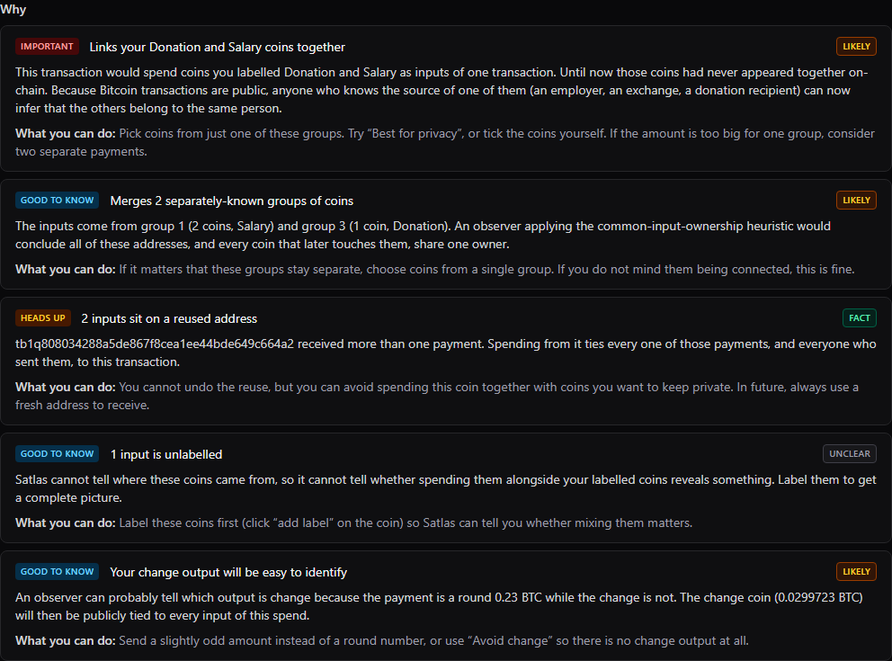
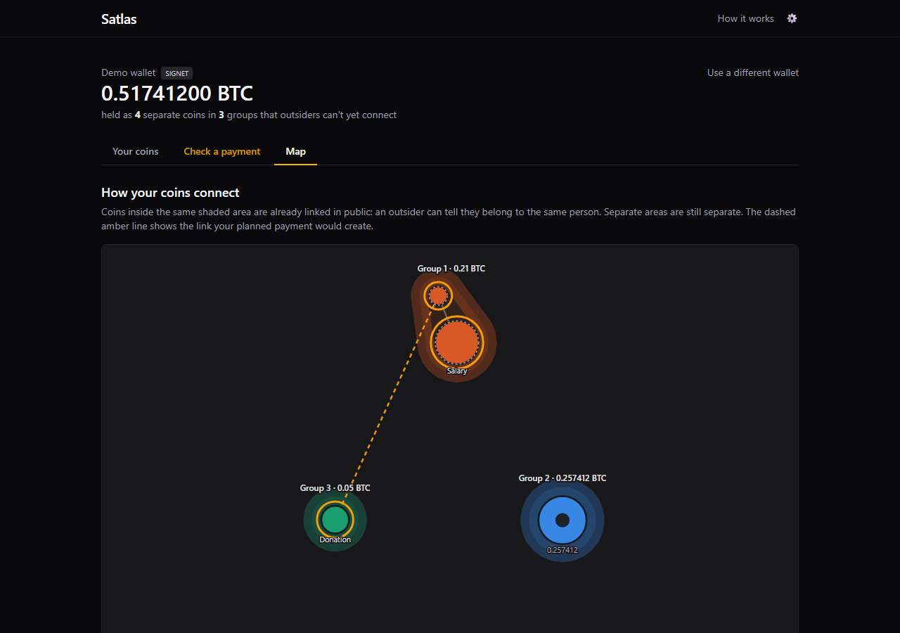

# Satlas

**Know what your Bitcoin reveals before you spend it.**

Satlas is a client-side Bitcoin privacy analyzer. Paste a watch-only xpub or descriptor, see
your wallet as individual coins, name where they came from, and check a payment *before* you
send it: Satlas tells you which coins your wallet would pick and, in plain English, what new
connections that payment would make public.

- **Watch-only.** No private keys, no signing, no broadcasting. Satlas cannot move your money.
- **No backend.** All analysis runs in your browser, in Rust compiled to WebAssembly.
- **Wallet-agnostic.** Keep using your existing wallet; Satlas is the checkup layer beside it.



## The problem

Bitcoin has no single balance. Your wallet holds separate coins (UTXOs), each with its own
history. When you pay someone, the wallet picks coins automatically, and if it picks two that
came from different parts of your life, say your salary and a donation, anyone watching the
blockchain can infer they belong to the same person. That link is permanent.

Most wallets never show you this. Satlas does, before it happens.

## Try it

```sh
cd web
pnpm install
pnpm wasm
pnpm dev          # open http://localhost:5173
```

Click **Explore with a demo wallet** for a synthetic wallet with Salary, Donation, Exchange and
Freelance coins, or paste your own xpub / zpub / descriptor. Then open **Check a payment** and
type `0.23`.

## Features

### Your coins
Every unspent coin, with its value, age, where it came from, and which group it belongs to.
Click **+ name this coin** to label it; change from a payment inherits the label of the coins
that funded it when that is unambiguous.



### Check a payment
Enter an amount. Satlas simulates the coin selection your wallet would make and explains the
result:

| Verdict | Meaning |
|---|---|
| **Safe to send** | Reveals nothing an observer could not already infer |
| **Mostly fine** | Some history is exposed, but no labelled coins are newly linked |
| **Careful** | Connects coins that were previously separate |

Each warning says *why* and *what you can do*. When a safer selection exists, a **Show me**
button switches to it and highlights the coins to pick with coin control in your real wallet.
Six selection methods are simulated and compared side by side: biggest first (most wallets'
default), oldest first, smallest first, avoid change, best for privacy, or pick coins yourself.



### Map
A force-directed map of the wallet. Bubbles are coins, sized by value. Shaded areas are groups
an outsider can already tie together. When you are checking a payment, the coins it would
spend pulse amber and a dashed line shows the new link it would create.



### History findings
What past transactions already reveal: reused addresses, past payments that merged groups of
coins, change outputs an observer can identify, and labelled coins that are already linked.

### Certainty on every conclusion
Satlas never presents a heuristic as a fact.

| Badge | Meaning |
|---|---|
| **Fact** | Recorded on the blockchain, or a label you added |
| **Likely** | A standard chain-analysis rule of thumb; usually right, not always |
| **Unclear** | Not enough information; labelling your coins helps |

### Portable labels (BIP-329)
Export your labels as [BIP-329](https://github.com/bitcoin/bips/blob/master/bip-0329.mediawiki)
JSONL and import them into Sparrow or any other compatible wallet, or import labels you already
have.

## How it works

```
 xpub / descriptor
        │
        ▼
 ┌───────────────── browser ──────────────────┐
 │  satlas-core (Rust → WASM)                  │
 │    derive addresses ──────┐                 │
 │                           ▼                 │      Esplora API
 │  TypeScript scanner ── gap-limit scan ──────┼──►  (mempool.space,
 │                           │                 │     blockstream.info,
 │                           ▼                 │     or your own)
 │  satlas-core                                │
 │    UTXOs · clustering · reuse · change      │
 │    detection · labels · spend simulation    │
 │                           │                 │
 │                           ▼                 │
 │  React UI  ◄── IndexedDB (labels, cache)    │
 └─────────────────────────────────────────────┘
```

**Heuristics** (all deterministic and explainable, in `crates/satlas-core/src/heuristics/`):

- **Common-input ownership.** Coins spent together are assumed to share an owner. History is
  replayed oldest-first with union-find; the transaction that first merged two groups is named.
- **Address reuse.** An address that received more than once ties every one of those payments
  together.
- **Change detection, from the observer's side.** Round payment amounts, script-type mismatch,
  change to a reused address, and unnecessary inputs all let an outsider spot your change.
- **Label mixing.** A payment whose inputs carry different labels from previously separate
  groups is flagged as creating a new public link.

**Scanning** is built for real wallets: a parallel gap-limit walk over receive and change
chains, retries with backoff that honour `Retry-After`, per-request timeouts, history pagination
checked against the provider's own transaction count, automatic failover between
mempool.space and blockstream.info, and an IndexedDB cache so a remembered wallet reopens
instantly and refreshes in the background.

## Trust model

Satlas has no server and never sees your keys. It does, however, ask a block explorer about
the addresses derived from your xpub, and by default that explorer is public. Its operator can
see which addresses you asked about. This is the same trade-off every watch-only wallet makes
with a public backend.

To remove it, point Satlas at your own Esplora or mempool instance under **Settings** (gear
icon). See [docs/trust-model.md](docs/trust-model.md).

Labels and cached scans live only in your browser's IndexedDB. **Forget** on the wallet screen
removes the remembered key and its cache from the device.

## Project layout

```
crates/
  satlas-core/    Pure Rust engine: no network, no WASM. Descriptors, UTXOs,
                  heuristics, simulator, BIP-329. Usable as a standalone library.
  satlas-wasm/    wasm-bindgen bindings for satlas-core.
web/
  src/api/        Esplora client and gap-limit scanner
  src/engine/     Typed facade over the WASM engine
  src/state/      zustand stores: wallet, labels, settings, simulator, cache
  src/components/ React UI
  src/demo/       Synthetic demo wallet
docs/             Trust model, screenshots
```

## Development

### Prerequisites

- Rust stable with the `wasm32-unknown-unknown` target (`rust-toolchain.toml` pins both)
- [`wasm-pack`](https://rustwasm.github.io/wasm-pack/)
- `clang`, needed to compile `secp256k1` for WASM. On Windows: `winget install LLVM.LLVM`, then
  add `C:\Program Files\LLVM\bin` to `PATH`
- Node 22+ and pnpm

### Commands

```sh
cargo test                  # engine tests, from the repo root

cd web
pnpm install
pnpm wasm                   # release build of the engine into web/src/wasm/pkg
pnpm wasm:dev               # faster, unoptimised engine build
pnpm dev                    # dev server on http://localhost:5173
pnpm test                   # UI and WASM-boundary tests
pnpm typecheck
pnpm build                  # production build into web/dist
```

Re-run `pnpm wasm` whenever Rust code changes.

Live integration test against a real mainnet wallet:

```sh
SATLAS_NETWORK_TESTS=1 pnpm test
SATLAS_NETWORK_TESTS=1 SATLAS_ESPLORA=https://blockstream.info/api pnpm test   # other provider
```

### Troubleshooting

- **`failed to find tool "clang"`** during `pnpm wasm`: install LLVM and put it on `PATH` (see above).
- **`Bulk memory operations require bulk memory`** from `wasm-opt`: already handled by the flags in
  `crates/satlas-wasm/Cargo.toml`; update if you changed them.
- **pnpm refuses to run esbuild's install script**: `pnpm approve-builds esbuild`.

## Limitations

- Observer-side change detection covers the common one-payment-plus-change shape; batched
  and multi-recipient spends are not analysed.
- Fee estimates assume `p2sh` inputs are wrapped segwit.
- The "avoid change" search considers at most 16 coins.
- A first scan of a large wallet over a public API can take tens of seconds.
- Heuristics describe what a typical chain-analysis observer would infer. They are not a
  guarantee of privacy, and CoinJoin or PayJoin transactions can defeat them.

## Roadmap

- Publish `satlas-core` as a standalone crate
- Incremental refresh that only re-checks addresses with new activity
- Change analysis for batched spends
- Import a PSBT to check the exact transaction your wallet built

## License

MIT, see [LICENSE](LICENSE).
