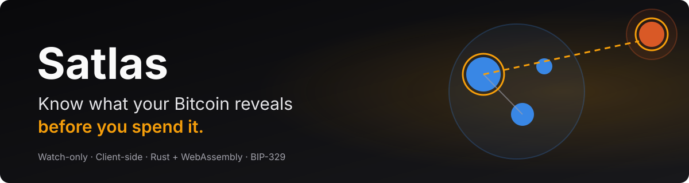
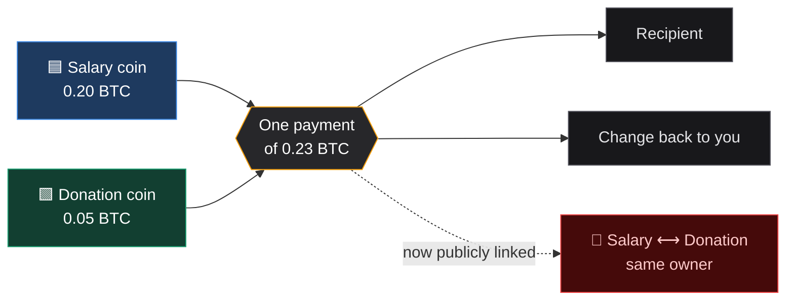
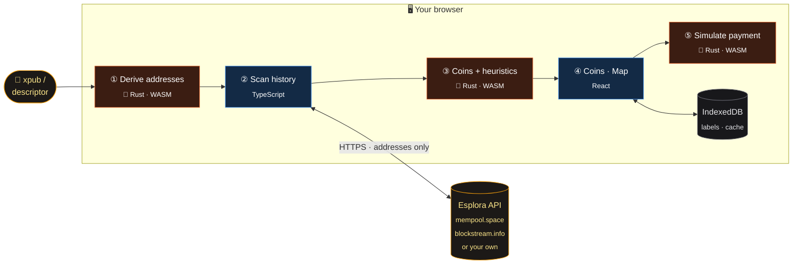
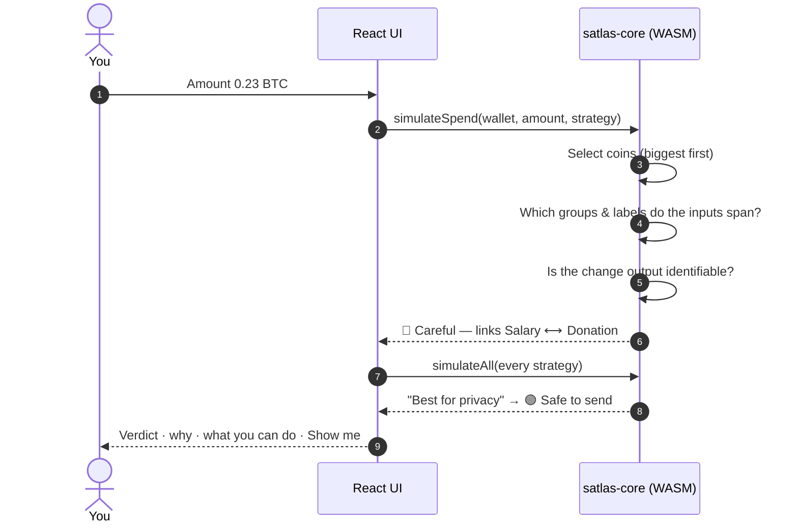
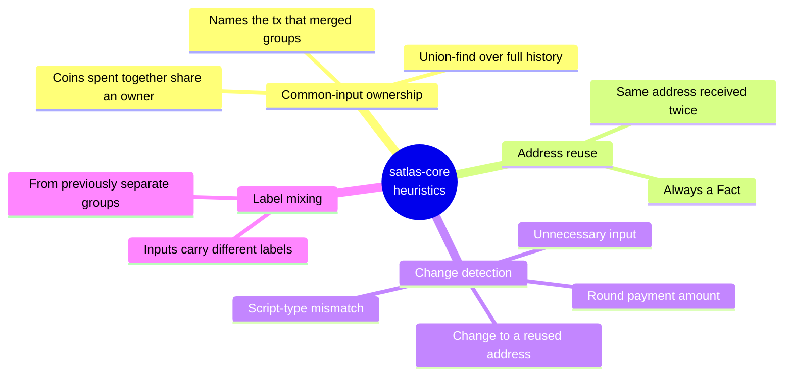
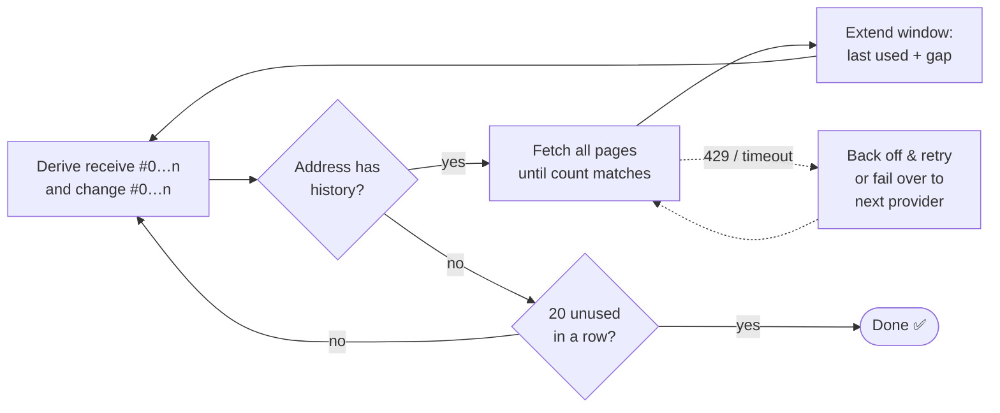
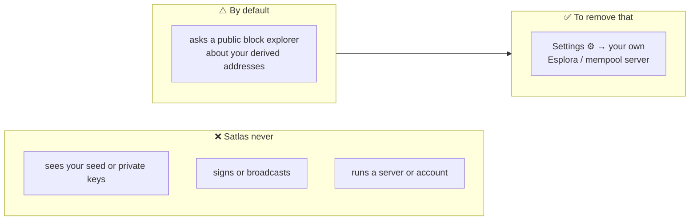

<div align="center">



<br />


<br />


**A client-side Bitcoin privacy analyzer.**
See your wallet as individual coins, name where they came from, and check a payment
*before* you send it — in plain English.

[**Quick start**](#-quick-start) · [**Features**](#-features) · [**How it works**](#-how-it-works) · [**Trust model**](#-trust-model) · [**Development**](#-development)

</div>

---

## 🧭 The problem

Bitcoin has no single balance. Your wallet holds **separate coins**, each with its own history.
When you pay someone, the wallet picks coins automatically — and if it picks two that came from
different parts of your life, everyone watching the blockchain learns they belong to the same person.
**Forever.**



Most wallets hide this behind automatic coin selection. **Satlas shows it to you before it happens** —
without holding your keys, replacing your wallet, or sending your data to a server.

<table>
<tr>
<td align="center" width="25%">🔑<br/><b>Watch-only</b><br/><sub>No private keys, no signing, no broadcasting</sub></td>
<td align="center" width="25%">🖥️<br/><b>No backend</b><br/><sub>All analysis runs in your browser via WASM</sub></td>
<td align="center" width="25%">🔌<br/><b>Wallet-agnostic</b><br/><sub>Works beside Sparrow, BlueWallet, Electrum…</sub></td>
<td align="center" width="25%">🧾<br/><b>Explainable</b><br/><sub>Every conclusion says why, and how sure it is</sub></td>
</tr>
</table>

---

## 🚀 Quick start

```sh
git clone https://github.com/CapThunder19/Satlas.git
cd Satlas/web
pnpm install
pnpm wasm      # build the Rust engine to WebAssembly
pnpm dev       # → http://localhost:5173
```

1. Click **Explore with a demo wallet** (or paste your own xpub / zpub / descriptor)
2. Open **Check a payment** and type `0.23`
3. Watch Satlas warn you that it would link *Salary* and *Donation* — then click **Show me** for a safer way

---

## ✨ Features

<table>
<tr>
<td width="50%" valign="top">

### 🪙 Your coins
Every unspent coin with its value, age, origin and group.
Click **+ name this coin** to label it; change inherits the label of
the coins that funded it when that's unambiguous.

</td>
<td width="50%" valign="top">

### 🔍 Check a payment
Type an amount. Satlas simulates the coins your wallet would pick
and tells you what that reveals — with a **Show me** button when a
safer selection exists.

</td>
</tr>
<tr>
<td></td>
<td></td>
</tr>
<tr>
<td width="50%" valign="top">

### 🗺️ Map
A force-directed map: bubbles are coins sized by value, shaded areas are groups
an outsider can already link, and a pulsing amber line shows the **new** link
your planned payment would create.

</td>
<td width="50%" valign="top">

### 🏠 Beginner-first
Three-step onboarding, per-wallet *"where's my xpub?"* help, a glossary,
jargon-free copy, and *"what you can do"* advice on every warning.

</td>
</tr>
<tr>
<td></td>
<td></td>
</tr>
</table>

### Verdicts

| | Verdict | Meaning |
|:-:|---|---|
| 🟢 | **Safe to send** | Reveals nothing an observer couldn't already infer |
| 🟡 | **Mostly fine** | Some history exposed, but no labelled coins newly linked |
| 🔴 | **Careful** | Connects coins that were previously separate |

### Certainty on every conclusion

Satlas never dresses a heuristic up as a fact.

| Badge | Meaning | Example |
|---|---|---|
|  | On the blockchain, or a label you added | *"This address received 2 payments"* |
|  | A standard chain-analysis rule of thumb | *"This output looks like change"* |
|  | Not enough information | *"This coin has no label"* |

### Six coin-selection strategies, compared side by side

| Strategy | What it models |
|---|---|
| Biggest coins first | The default in most wallets |
| Oldest coins first | FIFO |
| Smallest coins first | Consolidation |
| Avoid change | Exact-match subset, no change output |
| **Best for privacy** | Stay inside one already-linked group |
| I'll pick the coins | Manual coin control |

### More
- 🏷️ **BIP-329 labels** — export to / import from Sparrow and other compatible wallets
- 🌐 **Real-wallet scanning** — parallel gap-limit scan, retries, rate-limit backoff, automatic failover
- 💾 **Remember this wallet** — cached in IndexedDB, reopens instantly, refreshes in the background
- 🛠️ **Self-hosted backend** — point Satlas at your own Esplora / mempool instance
- 🧪 **Demo wallet** — synthetic history for trying it with zero setup

---

## ⚙️ How it works

### Architecture



<sub>🟧 Rust compiled to WebAssembly · 🟦 TypeScript / React · everything inside the box runs locally</sub>

### What happens when you check a payment



### The heuristics



<details>
<summary><b>Scanning a real wallet — the details</b></summary>

<br />



- Receive and change chains are scanned **in parallel**, each with its own worker pool
- Unused addresses cost **one** cheap stats request
- History pagination is checked against the provider's own transaction count, so nothing is silently dropped
- `Retry-After` is honoured; each request times out after 15 s so a dead host fails over fast
- Results are cached per descriptor, so reopening shows coins instantly while a refresh runs

</details>

---

## 🔐 Trust model



The block explorer's operator can see *which addresses you asked about* — the same trade-off every
watch-only wallet with a public backend makes. Point Satlas at your own server and no third party
sees them. Labels and cached scans stay in your browser; **Forget** wipes both.
Full details: [docs/trust-model.md](docs/trust-model.md).

---

## 🗂️ Project layout

```
satlas/
├── crates/
│   ├── satlas-core/        🦀 Pure Rust engine — no network, no WASM, reusable as a library
│   │   └── src/
│   │       ├── descriptor.rs    xpub / zpub / descriptor parsing, address derivation
│   │       ├── wallet.rs        transactions → UTXOs, balance, tx classification
│   │       ├── heuristics/      clustering · reuse · change detection · labels
│   │       ├── simulate.rs      coin selection + linkage analysis
│   │       └── bip329.rs        label import / export
│   └── satlas-wasm/        wasm-bindgen bindings
├── web/
│   └── src/
│       ├── api/            Esplora client + gap-limit scanner
│       ├── engine/         typed facade over the WASM engine
│       ├── state/          zustand stores (wallet · labels · settings · cache)
│       ├── components/     React UI (CoinGraph, Simulator, …)
│       └── demo/           synthetic demo wallet
└── docs/                   trust model, screenshots, banner
```

---

## 🛠️ Development

### Prerequisites

| Tool | Why | Install |
|---|---|---|
| Rust stable + `wasm32-unknown-unknown` | the engine | [rustup.rs](https://rustup.rs) (pinned by `rust-toolchain.toml`) |
| `wasm-pack` | Rust → npm package | `cargo install wasm-pack` |
| `clang` | compiles `secp256k1` for WASM | Windows: `winget install LLVM.LLVM` + add `C:\Program Files\LLVM\bin` to `PATH` |
| Node 22+ and pnpm | the UI | `npm i -g pnpm` |

### Commands

| Command | Where | What |
|---|---|---|
| `cargo test` | repo root | engine tests |
| `pnpm wasm` | `web/` | release build of the engine → `web/src/wasm/pkg` |
| `pnpm wasm:dev` | `web/` | faster, unoptimised engine build |
| `pnpm dev` | `web/` | dev server on http://localhost:5173 |
| `pnpm test` | `web/` | UI + WASM-boundary tests |
| `pnpm typecheck` | `web/` | TypeScript strict check |
| `pnpm build` | `web/` | production build → `web/dist` |

> [!TIP]
> Re-run `pnpm wasm` whenever you change Rust code.

<details>
<summary><b>Live network test against a real mainnet wallet</b></summary>

```sh
SATLAS_NETWORK_TESTS=1 pnpm test
SATLAS_NETWORK_TESTS=1 SATLAS_ESPLORA=https://blockstream.info/api pnpm test
```

Runs import → scan → analyse end to end on the public BIP-84 test-vector wallet.
</details>

<details>
<summary><b>Troubleshooting</b></summary>

| Error | Fix |
|---|---|
| `failed to find tool "clang"` | Install LLVM and put `C:\Program Files\LLVM\bin` on `PATH` |
| `Bulk memory operations require bulk memory` | Already handled by the `wasm-opt` flags in `crates/satlas-wasm/Cargo.toml` |
| pnpm won't run esbuild's install script | `pnpm approve-builds esbuild` |
| `npm.ps1 cannot be loaded` (PowerShell) | `Set-ExecutionPolicy -Scope CurrentUser RemoteSigned` |

</details>

---

## ⚠️ Limitations

> [!NOTE]
> Satlas describes what a **typical chain-analysis observer** would infer. It is not a privacy
> guarantee, and CoinJoin / PayJoin transactions can defeat these heuristics.

- Observer-side change detection covers the common *one payment + change* shape; batched spends aren't analysed
- Fee estimates assume `p2sh` inputs are wrapped segwit
- The *Avoid change* search considers at most 16 coins
- A first scan of a large wallet over a public API can take tens of seconds

## 🗺️ Roadmap

- [x] Descriptor & xpub import, UTXO discovery
- [x] Clustering, reuse and change heuristics with certainty levels
- [x] Pre-spend simulator with six strategies
- [x] BIP-329 export & import
- [x] Relationship map
- [x] Self-hosted endpoint, caching, failover
- [ ] Publish `satlas-core` as a standalone crate
- [ ] Incremental refresh (only re-check addresses with new activity)
- [ ] Change analysis for batched spends
- [ ] Import a PSBT to check the exact transaction your wallet built

---

<div align="center">

**Satlas** — because *"which coin should I spend?"* is really *"what will spending this reveal?"*

MIT License · built with 🦀 Rust, ⚛️ React and ₿ Bitcoin

</div>
